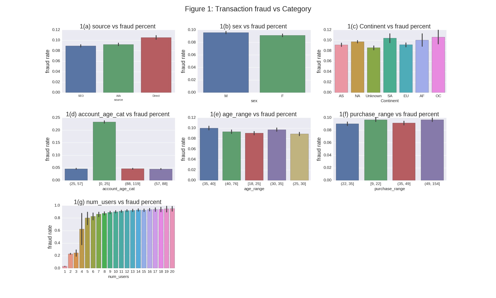
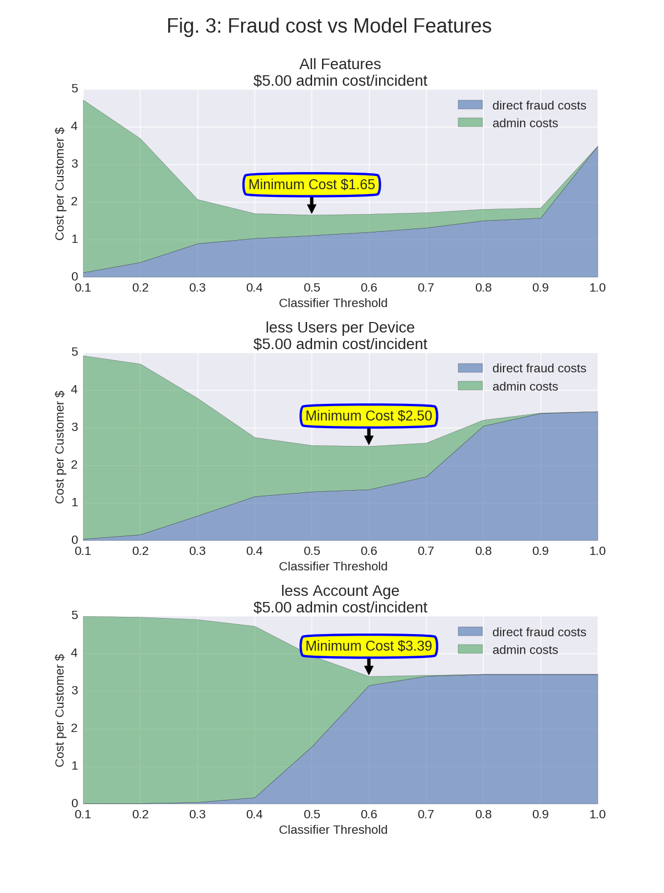

#Ecommerce Fraud Detection Study

##Introduction

Starting with a dataset of about 151,000 unique customer transactions, 14,000 transactions are classified as fraudulent which equates to an overall 9.4% fraud rate.  There was an additional dataset providing a mapping from the ip address of each transaction to the customer country.  By joining these two datasets, I matched about 130,000 customers to their origin country.  About 22,000 remain unknown.  From an external source, [http://blog.plsoucy.com/2012/04/iso-3166-country-code-list-csv-sql/](http://blog.plsoucy.com/2012/04/iso-3166-country-code-list-csv-sql/ ), I was able to group countries into continents for a more aggregated analysis.

Next, I looked at fraud rates for segments of the customer population.  One variable of interest was the age of the customer account.  It would make sense that newer accounts without much history would tend to have a higher proportion of the fraudulent activities.  I calculated the difference between the sign up date and the purchase data, and binned the results into quartiles.  I also binned customer ages into quintiles and purchase value into quartiles.  

As a further check, I verified that each of the 151,000 transactions belonged to a unique user_id.  I also checked the uniqueness of the device_id and found that 131,000 devices were each used in one transaction, but about 20,000 devices were used in multiple transactions.  It is possible that unique customers living in the same household might use a common device, but I wanted to investigate further.  It turns out that the remaining 20,500 transactions were associated with devices used in 2 or more transactions.  

Above is Fig. 1, a barplot, which plots the fraud rate against various categories.  Figure 1(a) shows that the highest fraud rates were associated with direct targeting of the website.  Males tend to have a higher fraud rate than females 1(b) .  New accounts with ages between 0 and 25 days have over a 20% fraud rate compared to all other accounts having less than a 16% rate.  There does not seem to be any pattern of fraud over customer age and purchase value.  For location (1(c)), fraud was more prevalent from Oceana, South America, and Africa.  North America was slightly above the average, wheras Asia and  Europe were below the average rate.  The most dramatic plot is figure 1(g), fraud rate as a function of number of users using a shared device.  When a device is shared by 2 or 3 users, the fraud rate is 20%.  This jumps to 60% at 4 users and 80% at 5 users ending at about 90% for numbers above that.       

  
  
Looking at Fig. 2, one can see that as a percentage of the total fraudulent activity, the United States makes up the highest percent of fraud, followed by a category of 'unknown' countries, China, Japan, UK, Korea, etc.  Together, 10 countries make up 80% of all fraud. 
 
##The model and fraud detection strategy

 For the classifier model, I used 6 predictive variables, including referring source, sex, continent, account_age, customer age, and number of users associated with a single device.  In order to guard against over-fitting I chose not to use each individual country in the model.  Next, I binarized each feature into category variables.  I ran various sklearn classifiers with train / test split of 70%, and found that random forest classifier was reasonally good and fast (using class_weights='balanced').  The F1-score which is a composite of recall and precision was 0.62 against the test data.  Without the device features, the f1 drops to 0.34 and then to 0.17 without device and account age.   
 
 Next, I made some assumptions about the financial impacts of various strategies.  For example, I assumed that the cost of an undetected fraudulent activity (false negative) would have a cost of the entire purchase value of that incident.  For cases in which the model predicted fraud, we would incur a $5 admin fee to process the inquiry into the transaction.  By spending this amount for predicting fraud, we would save the purchase value loss associated with a positive prediction that turned out to be a true case of fraud.    
 
The following confusion matrix shows that the costs would be under various prediction scenarios. 
   
                     Prediction                               
|       |          |False  | True  |
|--------------|--------|------------|-------|
|Actual | False | True Negative (0)      | False Positive (-5 admin)|
|  | True | False Negative (-Purchase Value)| True Positive (-5 admin)|

The model provides for each transaction, a probability that the transaction is fraudulent.  By using different threshold probabilities, one can estimate the average fraud costs of each strategy.  As seen in Figure 3 below, these costs vary with the threshold chosen.  A threshold of 0 would mean that all transactions are flagged, while a threshold of 1 would mean that no transactions are checked.  For each prediction, we calculate the cost based on the actual class and the predicted one, and then average the results to estimate the fraud cost per transaction.  There are three plots for Figure 3.  The top one includes all 6 features which has an f1-score of .62 at a threshold level of 0.50.  The resulting fraud burdern is lower because we can capture a lot of the fraud with high recall and precision.  
   
   

 

Based on the structure of admin costs, there may be an incentive to check more transactions if the administrative costs are fixed (i.e  no variable cost) vs. high variable costs.  At an admin cost of $0/transaction, we would use a threshold of zero and reduced the fraud cost is to $.13 (admin + loss)at a threshold of 0.  At a higher  administrative cost of $10, the cost becomes $2.14 at an optimal threshold of 0.8.

 

Random forest classifier has the ability to determine the most important features relevant to the classification. For this analysis, the number of customers using the same device was an important indicator of fraud followed by account age.  One caveat about duplicate devices, is that we may not be able to detect multiple people using a device until it actually happens.  The analysis was a snap shot in time with accumulated data.

Fraud detection requires balancing the expected costs of fraud with the customer relationship.  If an inquiry is made, how would the customer perceive the experience?  Would the customer be required to contact its bank to verify charges?  On the other hand, if no fraud prevention is used, what is the potential exposure?  Since the transaction sizes tend to be under $40, the exposure is approximately $3.50 per transaction.  However, if transaction sizes increase and we do not actively monitor the situation, our business insurance rates would also rise.  
      
 For now, the biggest driver for fraud may be new accounts in high growth countries.  A follow-up step would be to monitor the fraud rates for this segment as these customer purchases become a larger percentage of revenues.     
 
 